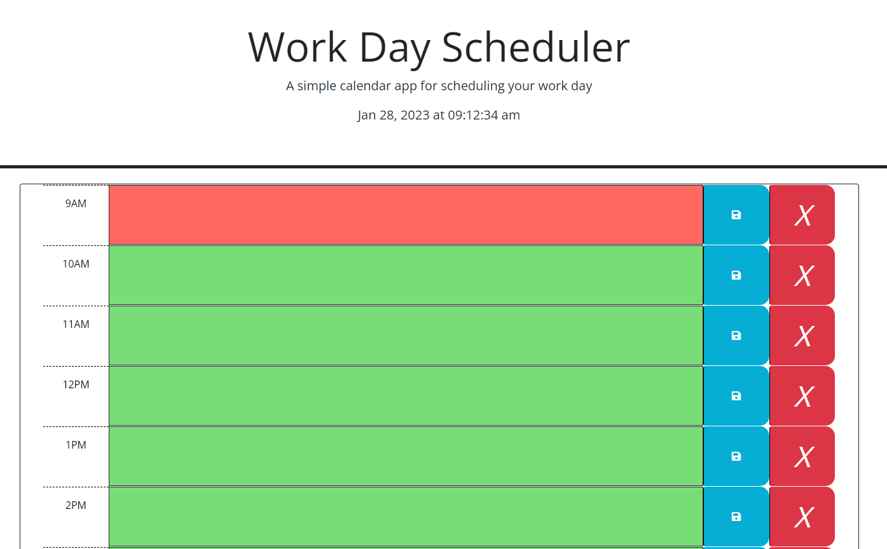

# Work-day-scheduler

## Description

Work Day Scheduler is a simple calendar application that allows you to save events for each hour (business hours) of the day, letting you know of the present past or future state of the event by changing colors

## Installation

No installation is required as this calendar runs in the browser.

## Usage

When you open the calendar you can see the current time at the top of the browser. Right below you can see the time blocks where you can log yor events from 9am to 5pm.
Each time block will change color, if your event is in the past the time block will be grayed out, if its the present time, it will be red and green for the future.
The buttons on the right allow you to save or delete the events.

## Credits

N/A

## License

MIT License

## link

The following image shows the web application's appearance:

## Screenshot

The following link displays the application on the web.

